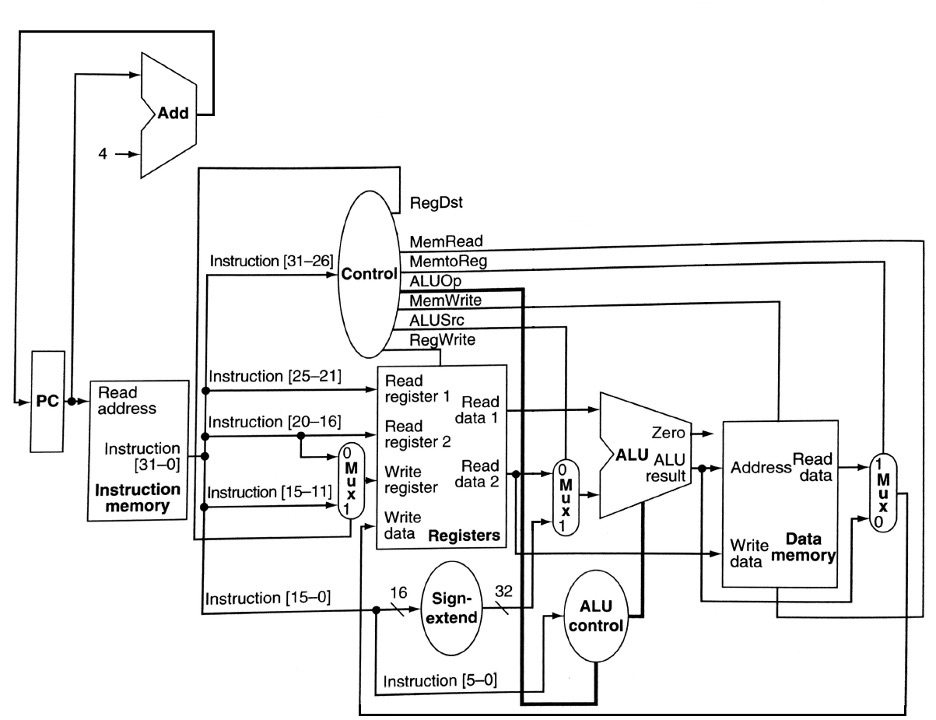
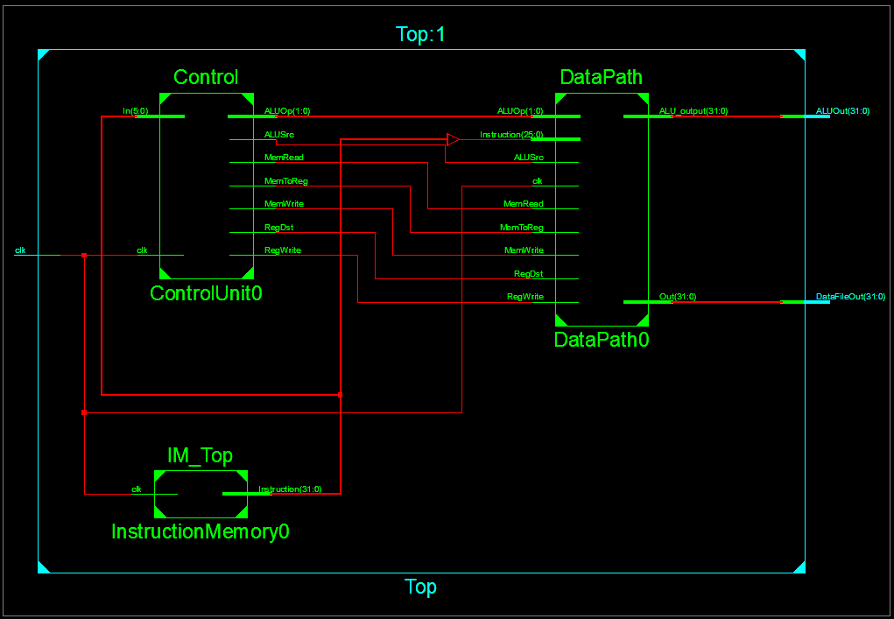
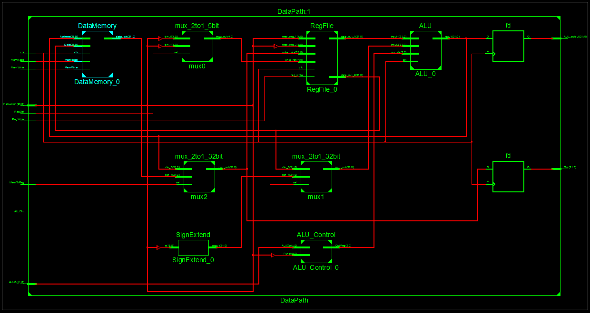
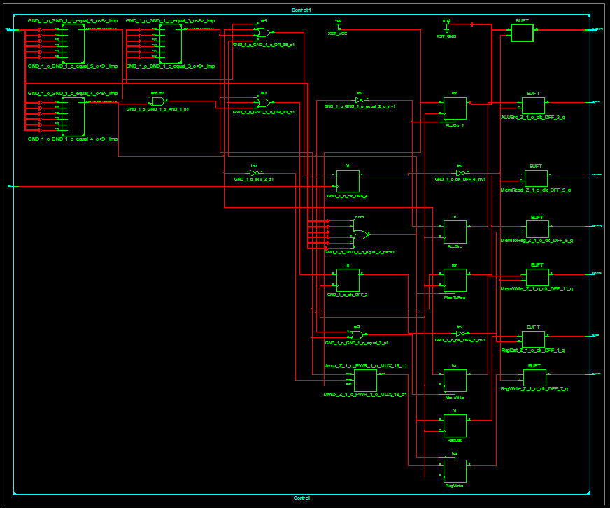
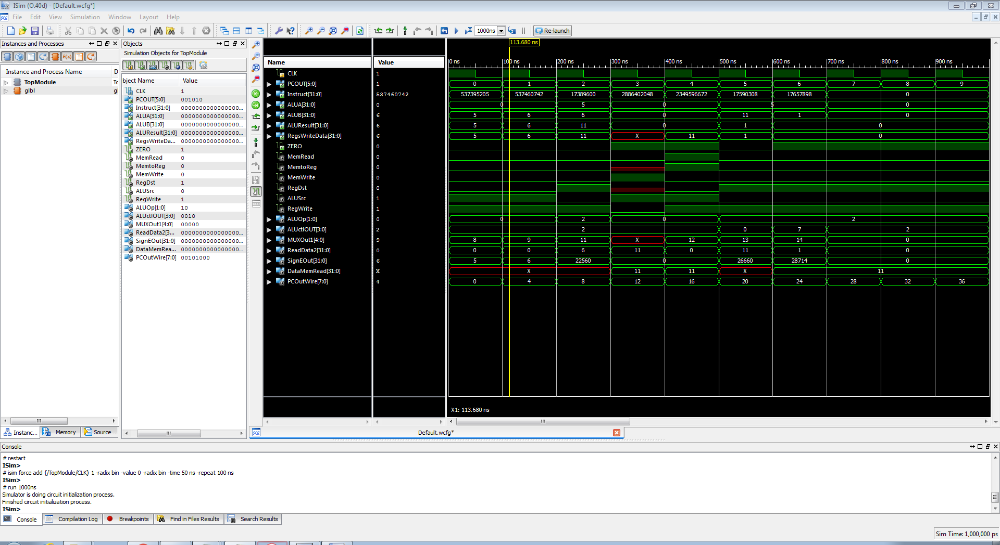

# MIPS CPU
Implementation of a 32-bit MIPS CPU in Verilog HDL.

  

## About MIPS Architecture
[MIPS](https://en.wikipedia.org/wiki/MIPS_architecture) (Microprocessor without Interlocked Pipelined Stages) is a family of Reduced Instruction Set (RISC) architectures. 

They are used in embedded systems such as residential routers and automotive systems. Historically, video game consoles such as the Nintendo 64, Sony PlayStation, PlayStation 2, and PlayStation Portable used MIPS processors.

## 2.	Synthesized RTL Schematics
### Top Module

  

### Datapath Module

  

### Control Module

  

## Simulation Results
Shows the waveforms from running fibonacci program in fib.asm

  

